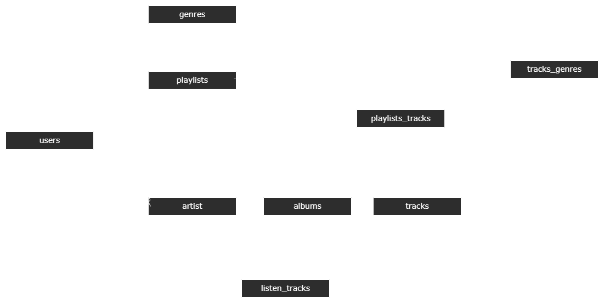
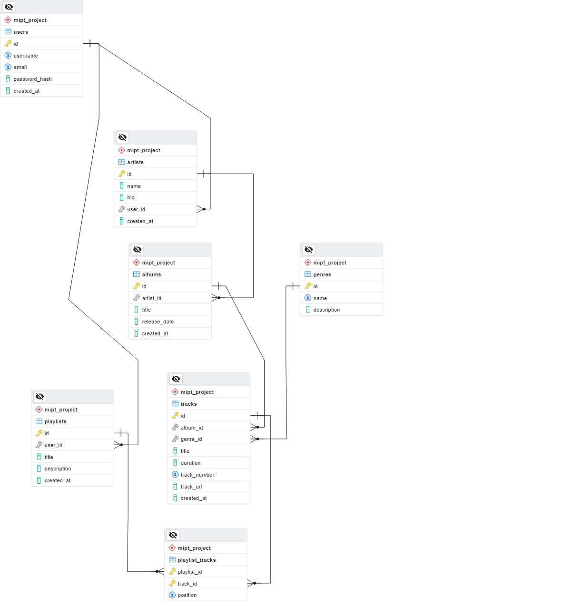
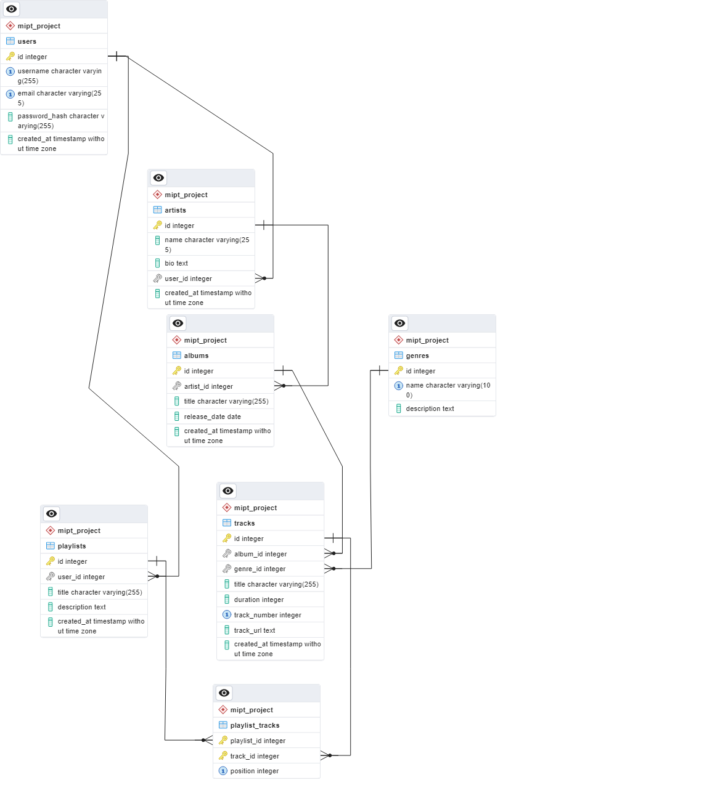

# mipt-db-project

## Концептуальная модель

[](models/concept.drawio.png)


## Логическая модель

[](models/logic.pgerd.png)

### Описание таблиц и полей

1. **users** - хранит информацию о пользователях системы
   - `id` (PK) - уникальный идентификатор пользователя
   - `username` - уникальное имя пользователя
   - `email` - уникальный email пользователя
   - `password_hash` - хеш пароля для безопасности
   - `created_at` - время создания записи

2. **artists** - содержит информацию об исполнителях
   - `id` (PK) - уникальный идентификатор исполнителя
   - `name` - имя исполнителя
   - `bio` - биография/описание
   - `user_id` (FK) - связь с пользователем (опционально)
   - `created_at` - время создания записи

3. **genres** - справочник музыкальных жанров
   - `id` (PK) - уникальный идентификатор жанра
   - `name` - название жанра (уникальное)
   - `description` - описание жанра

4. **albums** - хранит информацию об альбомах
   - `id` (PK) - уникальный идентификатор альбома
   - `artist_id` (FK) - связь с исполнителем
   - `title` - название альбома
   - `release_date` - дата выпуска
   - `created_at` - время создания записи

5. **tracks** - содержит информацию о музыкальных треках
   - `id` (PK) - уникальный идентификатор трека
   - `album_id` (FK) - связь с альбомом
   - `title` - название трека
   - `duration` - длительность в секундах
   - `track_number` - номер трека в альбоме
   - `track_url` - ссылка на аудиофайл
   - `created_at` - время создания записи

6. **track_genres** - связующая таблица между треками и жанрами (многие-ко-многим)
   - `track_id` (PK, FK) - идентификатор трека
   - `genre_id` (PK, FK) - идентификатор жанра

7. **playlists** - хранит информацию о плейлистах пользователей
   - `id` (PK) - уникальный идентификатор плейлиста
   - `user_id` (FK) - связь с пользователем-создателем
   - `title` - название плейлиста
   - `description` - описание плейлиста
   - `created_at` - время создания записи

8. **playlist_tracks** - связующая таблица между плейлистами и треками (многие-ко-многим)
   - `playlist_id` (PK, FK) - идентификатор плейлиста
   - `track_id` (PK, FK) - идентификатор трека
   - `position` - позиция трека в плейлисте

#### Связи между таблицами:

- Пользователь может создавать множество плейлистов (1:N)
- Пользователь может быть исполнителем (1:1, опциональная связь)
- Исполнитель может иметь множество альбомов (1:N)
- Альбом содержит множество треков (1:N)
- Трек может относиться к множеству жанров, а жанры могут содержать множество треков (M:N через track_genres)
- Плейлисты могут содержать множество треков, а треки могут быть в множестве плейлистов (M:N через playlist_tracks)

### Обоснование выбора нормальной формы

База данных спроектирована в соответствии с принципами Третьей нормальной формы (3NF), которая обеспечивает:

1. **Первую нормальную форму (1NF)**:
   - Все атрибуты имеют атомарные значения (нет многозначных атрибутов)
   - Каждая запись уникально идентифицируется первичным ключом
   - Нет повторяющихся групп полей

2. **Вторую нормальную форму (2NF)**:
   - Выполняются требования 1NF
   - Все неключевые атрибуты полностью зависят от первичного ключа
   - Отсутствуют частичные зависимости (например, трек имеет свой собственный ID)

3. **Третью нормальную форму (3NF)**:
   - Выполняются требования 2NF
   - Отсутствуют транзитивные зависимости (неключевые атрибуты зависят только от ключа, а не от других неключевых атрибутов)
   - Например, информация о жанре не хранится в таблице треков напрямую, а вынесена в отдельную таблицу жанров

Выбор 3NF позволяет:
- Минимизировать избыточность данных (например, информация об исполнителе хранится только в таблице artists)
- Обеспечить целостность данных (например, при изменении названия жанра оно обновится для всех треков)
- Оптимизировать структуру для будущих изменений (например, добавление новых атрибутов к жанрам не потребует изменения таблицы треков)

Отношения `playlist_tracks` и `track_genres` специально выделены в отдельные таблицы для представления связей многие-ко-многим, что соответствует принципам нормализации.

## Обоснование выбора типа версионирования (SCD)

В данной модели используется подход SCD Type 1 (Slowly Changing Dimension Type 1):

1. **SCD Type 1 (Перезапись)**:
   - Во всех основных таблицах используется только поле `created_at`, которое фиксирует время первоначального создания записи
   - При изменении данных старые значения перезаписываются новыми без сохранения истории изменений
   - Отсутствуют поля для отслеживания версий или истории изменений

Обоснование выбора SCD Type 1:
- **Простота**: Этот подход обеспечивает наиболее простую и понятную структуру базы данных
- **Производительность**: Не требует дополнительных таблиц или полей для хранения истории, что экономит место и повышает скорость запросов
- **Актуальность данных**: Гарантирует, что пользователи всегда работают с самыми свежими данными
- **Соответствие требованиям**: Для музыкального стриминг-сервиса обычно важнее иметь актуальную информацию, чем историю изменений

В данной модели не используются:
- **SCD Type 2** (добавление новых записей для версионирования), так как нет полей для отслеживания версий (например, `valid_from`, `valid_to`, `is_current`)
- **SCD Type 3** (хранение предыдущего значения в отдельном поле), так как нет полей типа `previous_value`
- **SCD Type 4** (использование отдельных исторических таблиц), так как нет вспомогательных таблиц для хранения истории изменений

Для музыкального стриминг-сервиса SCD Type 1 является обоснованным выбором, так как:
- Информация о треках, альбомах и исполнителях редко меняется радикально
- Пользователям важно видеть актуальную информацию, а не историю изменений
- Экономия ресурсов и простота поддержки системы имеют высокий приоритет

Если в будущем потребуется отслеживание истории изменений (например, для аналитики), модель можно расширить, добавив поля для версионирования или отдельные исторические таблицы. Но на данный этап это не является необходимой мерой.

## Физическая модель

[](models/phys.pgerd.png)

## Скрипты

### [ddl.sql](sql/ddl.sql)
```postgresql
-- Пересоздаём схему mipt_project
DROP SCHEMA IF EXISTS mipt_project CASCADE;
CREATE SCHEMA mipt_project;

-- Устанавливаем search_path, чтобы использовать схему project
SET search_path TO mipt_project;

-- Таблица пользователей
CREATE TABLE IF NOT EXISTS users
(
   id            SERIAL PRIMARY KEY,
   username      VARCHAR(255) UNIQUE NOT NULL,
   email         VARCHAR(255) UNIQUE NOT NULL,
   password_hash VARCHAR(255)        NOT NULL,
   created_at    TIMESTAMP DEFAULT CURRENT_TIMESTAMP
);

-- Таблица исполнителей
CREATE TABLE IF NOT EXISTS artists
(
   id         SERIAL PRIMARY KEY,
   name       VARCHAR(255) NOT NULL,
   bio        TEXT,
   user_id    INTEGER      REFERENCES users (id) ON DELETE SET NULL,
   created_at TIMESTAMP DEFAULT CURRENT_TIMESTAMP
);

-- Таблица жанров
CREATE TABLE IF NOT EXISTS genres
(
   id          SERIAL PRIMARY KEY,
   name        VARCHAR(100) UNIQUE NOT NULL,
   description TEXT
);

-- Таблица альбомов
CREATE TABLE IF NOT EXISTS albums
(
   id           SERIAL PRIMARY KEY,
   artist_id    INTEGER      NOT NULL REFERENCES artists (id) ON DELETE CASCADE,
   title        VARCHAR(255) NOT NULL,
   release_date DATE DEFAULT CURRENT_DATE,
   created_at   TIMESTAMP DEFAULT CURRENT_TIMESTAMP
);


-- Таблица плейлистов
CREATE TABLE IF NOT EXISTS playlists
(
   id          SERIAL PRIMARY KEY,
   user_id     INTEGER      NOT NULL REFERENCES users (id) ON DELETE CASCADE,
   title       VARCHAR(255) NOT NULL,
   description TEXT,
   created_at  TIMESTAMP DEFAULT CURRENT_TIMESTAMP
);

-- Таблица треков
CREATE TABLE IF NOT EXISTS tracks
(
   id           SERIAL PRIMARY KEY,
   album_id     INTEGER      NOT NULL REFERENCES albums (id) ON DELETE CASCADE,
   title        VARCHAR(255) NOT NULL,
   duration     INTEGER NOT NULL CHECK ( duration > 0 ), -- продолжительность в секундах
   track_number INTEGER NOT NULL,
   track_url    TEXT NOT NULL,    -- ссылка на аудиофайл для подгрузки
   created_at   TIMESTAMP DEFAULT CURRENT_TIMESTAMP,
   CONSTRAINT unique_track_number_per_album UNIQUE (album_id, track_number)
);

-- Вспомогательная таблица для связи треков и жанров (многие ко многим)
CREATE TABLE IF NOT EXISTS track_genres
(
   track_id    INTEGER NOT NULL REFERENCES tracks (id) ON DELETE CASCADE,
   genre_id    INTEGER NOT NULL REFERENCES genres (id) ON DELETE CASCADE,
   PRIMARY KEY (track_id, genre_id)
);

-- Вспомогательная таблица для связи плейлистов и треков (многие ко многим)
CREATE TABLE IF NOT EXISTS playlist_tracks
(
   playlist_id INTEGER NOT NULL REFERENCES playlists (id) ON DELETE CASCADE,
   track_id    INTEGER NOT NULL REFERENCES tracks (id) ON DELETE CASCADE,
   position    INTEGER NOT NULL CHECK ( position > 0 ), -- порядок трека в плейлисте
   PRIMARY KEY (playlist_id, track_id),
   CONSTRAINT unique_track_position_per_playlist UNIQUE (playlist_id, position)
);
```