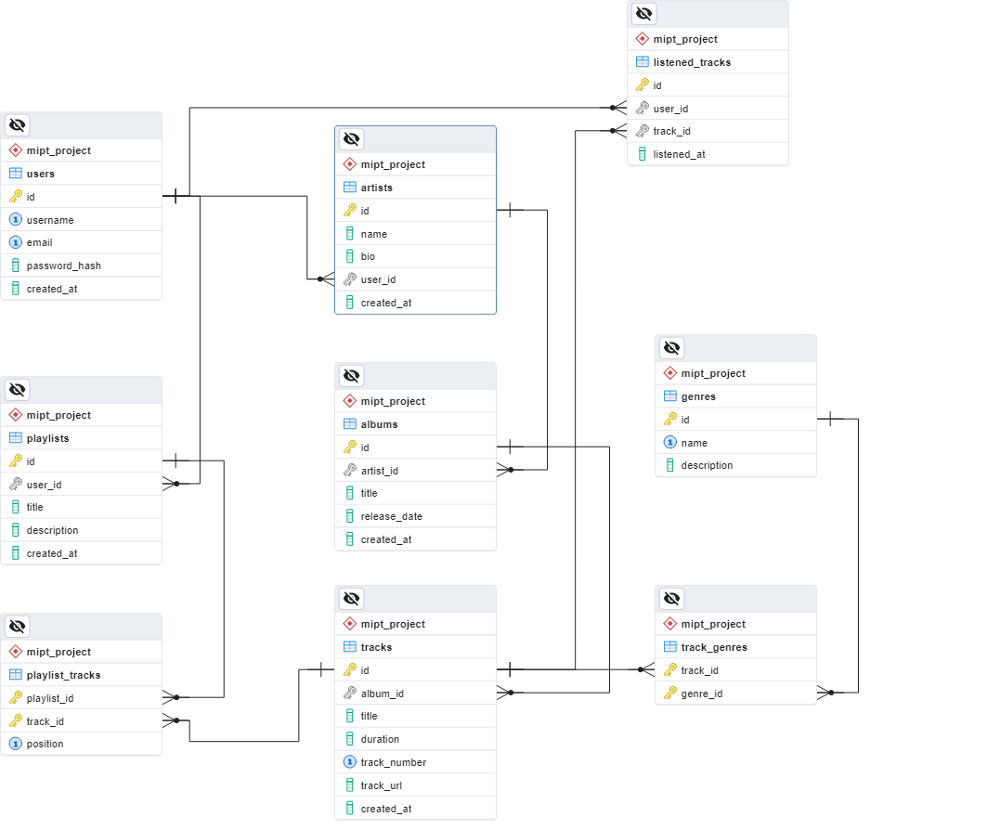
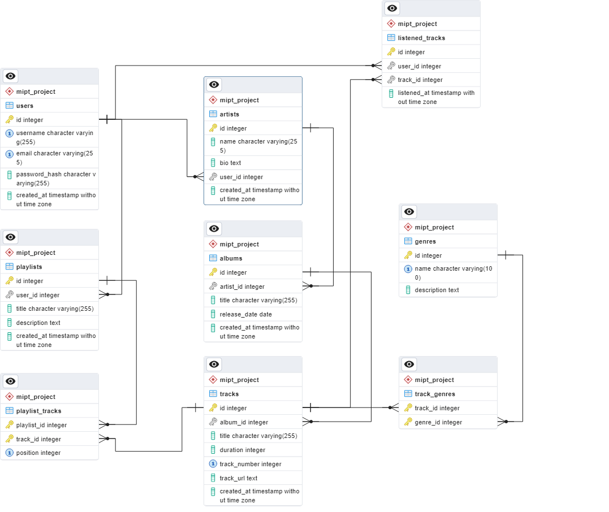

# mipt-db-project: База данных музыкального стриминг-сервиса

## Концептуальная модель

## Логическая модель

### Описание таблиц и полей

1. **users** — хранит информацию о пользователях системы
   - `id` (PK) — уникальный идентификатор пользователя
   - `username` — уникальное имя пользователя
   - `email` — уникальный email пользователя
   - `password_hash` — хеш пароля для безопасности
   - `created_at` — время создания записи

2. **artists** — содержит информацию об исполнителях
   - `id` (PK) — уникальный идентификатор исполнителя
   - `name` — имя исполнителя
   - `bio` — биография/описание
   - `user_id` (FK) — связь с пользователем (опционально)
   - `created_at` — время создания записи

3. **genres** — справочник музыкальных жанров
   - `id` (PK) — уникальный идентификатор жанра
   - `name` — название жанра (уникальное)
   - `description` — описание жанра

4. **albums** — хранит информацию об альбомах
   - `id` (PK) — уникальный идентификатор альбома
   - `artist_id` (FK) — связь с исполнителем
   - `title` — название альбома
   - `release_date` — дата выпуска (по умолчанию текущая дата)
   - `created_at` — время создания записи

5. **tracks** — содержит информацию о музыкальных треках
   - `id` (PK) — уникальный идентификатор трека
   - `album_id` (FK) — связь с альбомом
   - `title` — название трека
   - `duration` — длительность (в секундах, с проверкой, что значение > 0)
   - `track_number` — номер трека в альбоме
   - `track_url` — ссылка на аудиофайл
   - `created_at` — время создания записи
   - **Ограничение**: уникальность номера трека в пределах одного альбома

6. **track_genres** — связующая таблица между треками и жанрами (связь многие-ко-многим)
   - Составной первичный ключ: (`track_id`, `genre_id`)

7. **playlists** — хранит информацию о плейлистах пользователей
   - `id` (PK) — уникальный идентификатор плейлиста
   - `user_id` (FK) — связь с пользователем-создателем
   - `title` — название плейлиста
   - `description` — описание плейлиста
   - `created_at` — время создания записи

8. **playlist_tracks** — связующая таблица между плейлистами и треками (связь многие-ко-многим)
   - Составной первичный ключ: (`playlist_id`, `track_id`)
   - `position` — позиция трека в плейлисте (значение > 0)
   - **Ограничение**: уникальное значение позиции в пределах одного плейлиста

#### Дополнительные таблицы версионирования

Для аудита и сохранения истории изменений добавлены специальные таблицы, которые логируют операции над основными сущностями и связями:

- **users_history** — хранит историю изменений таблицы `users`
- **artists_history** — история изменений для `artists`
- **genres_history** — история изменений для `genres`
- **albums_history** — история изменений для `albums`
- **tracks_history** — история изменений для `tracks`
- **playlists_history** — история изменений для `playlists`
- **track_genres_history** — история изменений для связи треков и жанров
- **playlist_tracks_history** — история изменений для связи плейлистов и треков

#### Связи между таблицами

- Пользователь может создавать множество плейлистов (1:N).
- Пользователь может быть исполнителем (1:1, опциональная связь).
- Исполнитель может иметь множество альбомов (1:N).
- Альбом содержит множество треков (1:N).
- Трек может относиться к множеству жанров, а жанры — содержать множество треков (M:N через track_genres).
- Плейлисты могут содержать множество треков, а треки могут входить в несколько плейлистов (M:N через playlist_tracks).

### Обоснование выбора нормальной формы

База данных спроектирована согласно принципам Третьей нормальной формы (3NF):

1. **Первая нормальная форма (1NF):**
   - Все атрибуты атомарны, каждая запись идентифицируется первичным ключом и отсутствуют повторяющиеся группы полей.

2. **Вторая нормальная форма (2NF):**
   - Все неключевые атрибуты зависят полностью от первичного ключа, исключены частичные зависимости.

3. **Третья нормальная форма (3NF):**
   - Отсутствуют транзитивные зависимости: данные, не относящиеся напрямую к ключу, вынесены в отдельные таблицы (например, сведения о жанрах).

Преимущества 3NF:
- Минимизация избыточности (например, данные об исполнителе хранятся только в таблице `artists`).
- Обеспечение целостности данных (изменение информации в одном месте отражается во всех зависимых записях).
- Гибкость для внесения будущих изменений без нарушения структуры базы данных.

### Обоснование выбора типа версионирования (SCD)

В данной модели реализован механизм аудита с сохранением истории изменений через отдельные *_history таблицы. При этом:

- **Основная таблица** содержит всегда актуальные данные, что соответствует модели SCD Type 1.
- **Исторические таблицы** аккумулируют все изменения, позволяя восстанавливать историю изменений.

Такой механизм, при котором история изменений хранится в отдельных таблицах, соответствует **SCD Type 4**. Данный подход обеспечивает:
- Сохранение полной истории изменений для аудита и аналитики.
- Отсутствие дополнительных полей в основных таблицах, что сохраняет их простоту и эффективность.
- Возможность быстро получать актуальные данные и, при необходимости, выполнять анализ истории изменений.

## Физическая модель

## Скрипты

### [ddl.sql](scripts/ddl.sql)

### [ddl.sql](scripts/dml.sql)

### [examples](scripts/examples)

